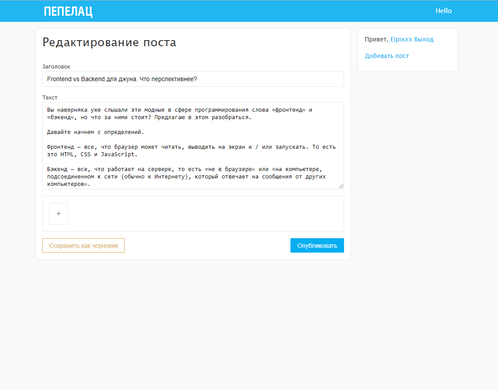
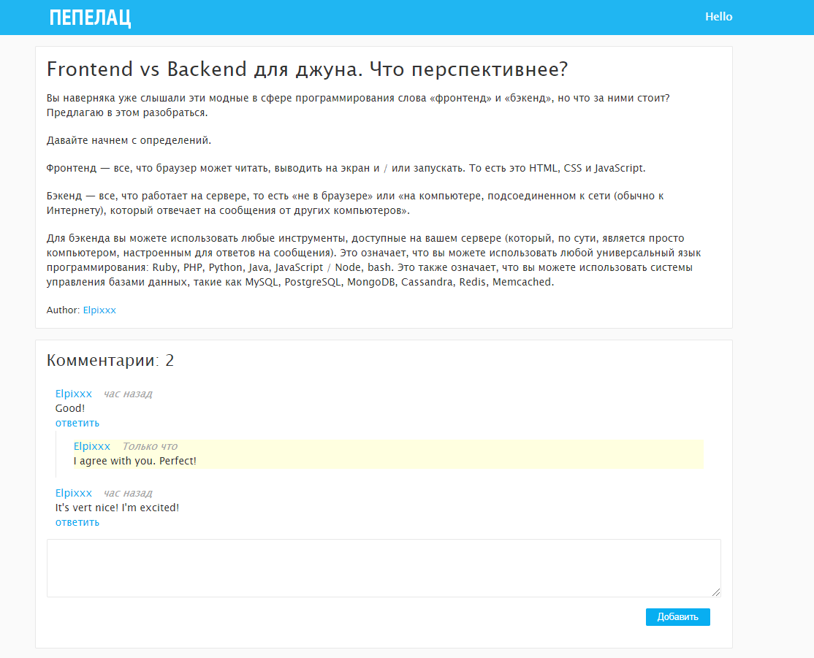

**NEM** - servisе, where you can read a lot of articles about different topics and write your own articles, stories etc.

App has next stack of technologies:
  - **Frontend:**
    - HTML / CSS
    - Jquery
    - EJS (tepmlate)

  - **Backend:**
    - NodeJs
    - Express
    - MongoDB

**"npm install"** - for installing all the dependencies

**"npm run dev"** - for starting this project on 5000 port (before it you need to have database 'MongoDb' and start it (command 'mongod' in the root folder))

## Using
- When you go to the site for the first time you can see all the articles that was written by other users. It looks like:

In the center - all articles. In the sidebar - form for registration and login.

- If you are going to post your own articles you need to register. When are you registered you can post some articles. It looks like:

- If you noticed mistake in your article and want to add more information, you always can edit your post. It looks like:

- You need to input the title and text. And if you want to you can add images. When you post this article, it will be shown in the main page for all users.

- Do you like the article or want to say more? You can add the comment! It looks like:

## **Read more usefull information and share it with the world.**

